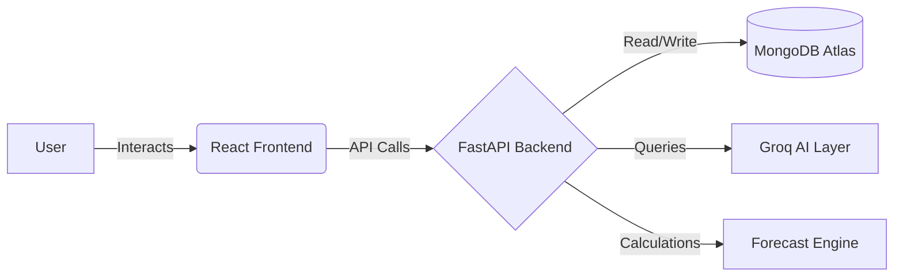

# STRATIFY 🚀
**Built by Tech Titans**

> *AI-Powered Financial Intelligence & Investor Discovery Platform for Startups*

---

## 👥 Founders
**Sahil, Habis, Arshita, Raghav**  
**Team**: Tech Titans

---

## 🚀 Overview
**STRATIFY** is a comprehensive, AI-driven platform designed to solve the critical "financial visibility" problem faced by early-stage startups. We empower founders with professional-grade financial intelligence, runway forecasting, scenario simulation, and a streamlined investor discovery pipeline. STRATIFY bridges the gap between raw data and actionable strategy, helping startups secure their financial future and connect with the right backers.

---

## 🎯 Problem Statement
Startups often fail not because of a bad product, but due to poor financial visibility. Founders struggle to track burn rates, predict runway accurately, simulate different business scenarios, and identify relevant investors. Traditional spreadsheets are static, error-prone, and lack the predictive power and insights needed to navigate the dynamic startup ecosystem.

---

## 💡 Solution
STRATIFY provides a unified interface to transform disjointed financial data into a cohesive strategy:
- **Interactive Dashboard:** Real-time visibility into key financial metrics.
- **Dynamic Forecasting:** AI-enhanced runway calculations based on historical data and projected growth.
- **Investor Finder:** Direct access to a curated database of investors actively looking for opportunities in your sector.
- **Scenario Simulation:** "What-if" analysis to stress-test your business model before making critical decisions.

---

## ✨ Core Features
- 📊 **Financial Dashboard:** Visualize revenue, expenses, burn rate, and runway.
- 🔮 **AI Runway Predictor:** Get intelligent forecasts and early warnings about cash flow crunches.
- 🔀 **Scenario Simulator:** Model different hiring plans, marketing spends, or revenue outcomes.
- 🧠 **Pivot Ideation Engine:** AI-generated suggestions for strategic pivots based on market data and your financial health.
- 🤝 **Investor Finder:** Leverage the OpenVC dataset to find the perfect match for your next funding round.
- 📁 **CSV Upload:** Easily import your existing financial data.
- 🔐 **Authentication:** Secure user and organization management.

---


## ⚡ Challenges Faced
- API response delays during investor search
- Handling large financial datasets on UI
- Maintaining clean component structure

## ✅ Solutions Implemented
- Added loading states & optimized API calls
- Used pagination for large data
- Modularized components for maintainability.


## 🧠 Tech Stack
- **Frontend:** React, TypeScript, Tailwind CSS
- **Backend:** FastAPI, Python
- **Database:** MongoDB
- **AI:** Groq LLM + Advanced Financial Algorithms
- **Deployment:** Netlify (Frontend), Render (Backend), MongoDB Atlas (Database)

---

## 🏗 Architecture Overview


---

## 📦 Installation Guide

### Backend Setup
```bash
cd backend
python -m venv venv
source venv/bin/activate  # On Windows: venv\Scripts\activate
pip install -r requirements.txt
uvicorn app.main:app --reload
```

### Frontend Setup
```bash
cd frontend
npm install
npm run dev
```

---

## 🔐 Environment Variables
You will need to configure the following environment variables. See the `.env.example` file for details.

```env
MONGODB_URI=your_mongodb_connection
JWT_SECRET=your_secret_key
GROQ_API_KEY=your_api_key
```

---

## 🌍 Live Demo
* [STRATIFY Platform](https://your-live-demo-link.netlify.app)
* [API Documentation](https://your-backend-render-link.onrender.com/docs)

*(Note: Live links are placeholders and should be updated post-deployment)*

---

## 📈 Future Roadmap
- Integration with major accounting software (QuickBooks, Xero).
- Advanced Cap Table management.
- Real-time collaboration features for co-founders and advisors.
- Automated pitch deck generation based on financial data.

---

## 🏆 Hackathon Submission
- **Team:** Tech Titans
- **Project:** STRATIFY
- **Category:** AI + FinTech

---

## 📜 License
This project is licensed under the [MIT License](LICENSE).
